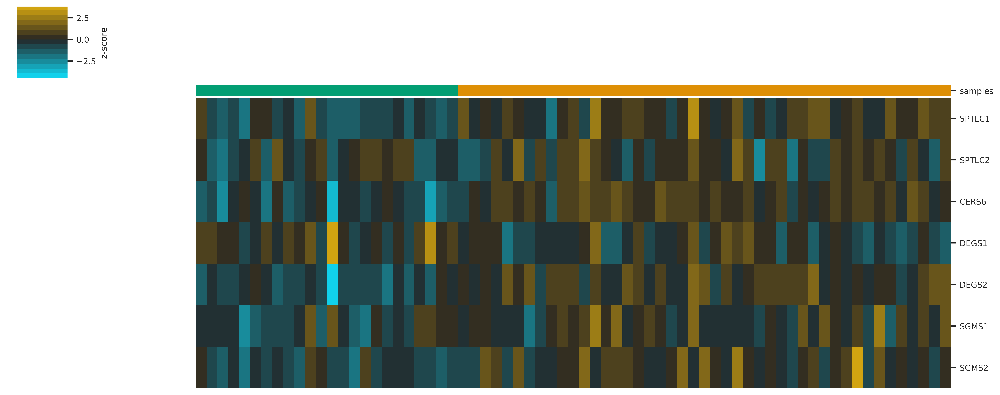
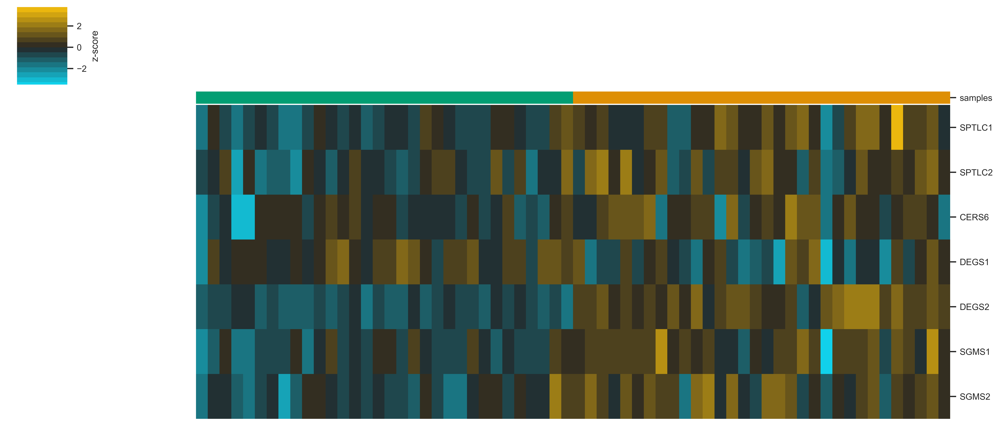

# Analysis scripts for Li, et. al.

### Figure Legends
Microarray expression values were z-score scaled. Samples were clustered via calculating the Euclidean distance between centroids. See ([1](https://doi.org/10.1016/j.cmet.2019.11.002)) for raw data curation and ([2](https://github.com/j-berg/summers_2020)) for the associated analysis code for this manuscript. The data was originally generated as part of ([3](https://doi.org/10.1371/journal.pone.0013091)) and ([4](https://doi.org/10.1158/1541-7786.mcr-07-0267)) and can be accessed using the GEO identifiers [GSE20916](http://www.ncbi.nlm.nih.gov/geo/query/acc.cgi?acc=GSE20916) and [GSE8671](http://www.ncbi.nlm.nih.gov/geo/query/acc.cgi?acc=GSE8671) ([5](https://www.ncbi.nlm.nih.gov/geo/)).

##### GSE20916


##### GSE8671


### Methods
Microarray expression data were accessed and analyzed as described in ([1](https://doi.org/10.1016/j.cmet.2019.11.002)). Briefly, human microarray data were accessed from the GEO database [GSE20916](http://www.ncbi.nlm.nih.gov/geo/query/acc.cgi?acc=GSE20916) and [GSE8671](http://www.ncbi.nlm.nih.gov/geo/query/acc.cgi?acc=GSE8671) ([5](https://www.ncbi.nlm.nih.gov/geo/)) under the inclusion parameters of "normal" tissue and non-cancer "adenoma" tissue. Multimapping probes were dropped and probe sets mapping to the same gene were collapsed and averaged. Heatmaps were generated using XPRESSplot (v0.2.5) ([6](https://doi.org/10.1371/journal.pcbi.1007625)). GEO datasets were parsed using the GEOparse package (v2.0.2) ([https://pypi.org/project/GEOparse/](https://pypi.org/project/GEOparse/)). Gene set normalization was performed with scikit-learn (v0.23.2) (7) (Buitinck et al., 2013) within the Python (v3.8.6) environment. Data processing and analyses can be interactively replicated using Jupyter Notebook ([https://jupyter.org](https://jupyter.org)) at ([8](null)).

### References
[7] Pedregosa, F., Varoquaux, G., Gramfort, A., Michel, V., Thirion, B., Grisel, O., Blondel, M., Prettenhofer, P., Weiss, R., Dubourg, V., Vanderplas, J., Passos, A., Cournapeau, D., Brucher, M., Perrot, M., Duchesnay, E. Scikit-learn: Machine Learning in Python (2011). Journal of Machine Learning Research, vol 12.    
[8] Zenodo URL for archived analysis

### To reproduce the analyses from these scripts:
The following example will show  how to install and run the analyses on a *nix OS.

1. Download [Conda](https://conda.io/projects/conda/en/latest/user-guide/install/index.html) and install.
2. Download [this repository](https://github.com/j-berg/summers_2020/archive/main.zip).
3. Unzip the folder and navigate to the folder using the command line. For example, if you downloaded the zip file to your Desktop:
```bash
cd ~/Desktop/
unzip li_2021-main.zip
cd li_2021-main
```
4. Create a conda environment:
```bash
conda env create -n li_analysis -f requirements.txt
conda activate li_analysis
conda activate jupyter
pip install GEOparse
```

5. Launch Juypter Notebook (from within the `li_2021-main` directory):
```bash
jupyter notebook
```

### Requirements:  
* `Python3`   
* `Pandas`
* `NumPy`
* `Matplotlib`
* `Seaborn`
* `Scikit-Learn`
* `XPRESSplot`
* `GEOparse`
